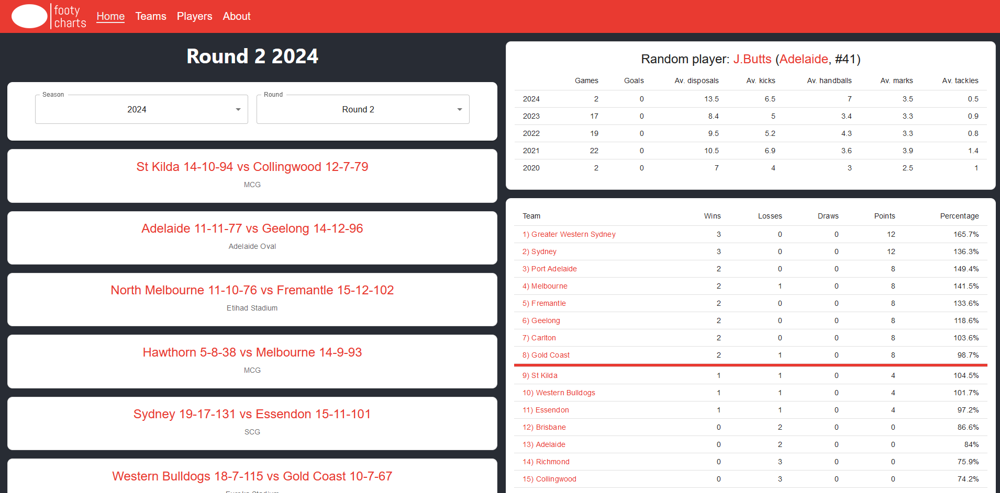
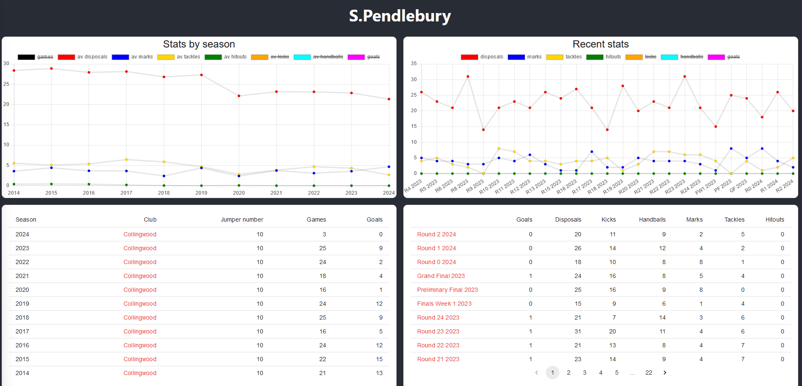
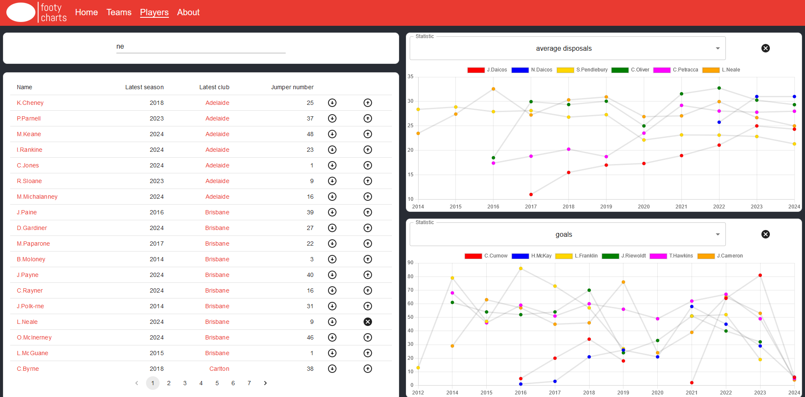
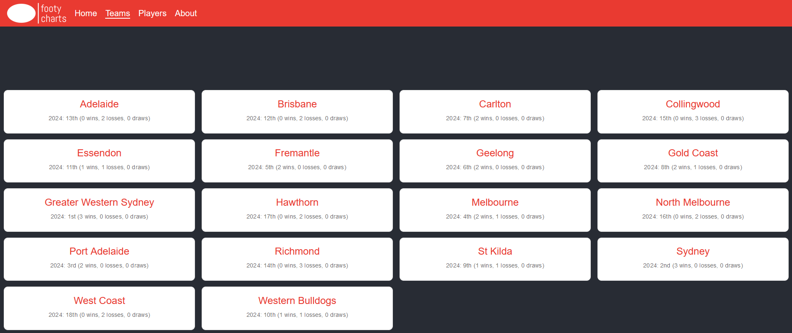

# showcase-site

## Plan
- Windows dev environment
- React front-end
- Single-page app with client-side routing (static JS and templated HTML)
- Flask API server
- PostgreSQL database
- Data to display: AFL
- Deployment using Render

## Screenshots
Home page:


Match page:


Individual player page:


Team page:


Player search page:


All teams page:


## Setup
```bash
npm run watch
flask --app api/app run
psql -d postgres -U site_admin
python311 ingest_historical.py
python311 -c "from ingest_live import job; job()"
python311 ingest_live.py
```

```sql
CREATE DATABASE site_db;
```

## Site design
- Home page shows the current season's ladder, current round's matches and a random player's stats
- Each team can be selected; this will show a list of all the team's current players
- Each match can be selected; this will show a field with all players in the match and their stats
- Each player can be selected; this will show their historical stats
- Teams page showing list of teams

## TODO
- Fix API requests to unknown routes
- 404 page
- Styling
- Players page with players searchable by text
- Pagination of home page to show ladder and matches for previous rounds and 
- Player search string in URL
- Websocket for updating live data
- Search for alternate datasets and possibly replace DTLive data:
  - https://datasportsgroup.com/coverage/australian-football/
  - https://api.squiggle.com.au/ (no player stats)
  - https://jimmyday12.github.io/fitzRoy/index.html
  - https://jimmyday12.github.io/fitzRoy/articles/using-fryzigg-stats.html
  - https://www.footywire.com/
  - https://afltables.com (SSR)
  - https://finalsiren.com (SSR)
- Check DTLive terms of use
- Update Render to paid version (database expires June 23 2024) or switch deployment method
- Update ingest scripts to bulk upsert
- Better scrollboxes for mobile
- Prevent site from crashing when a request fails
- About page with data source